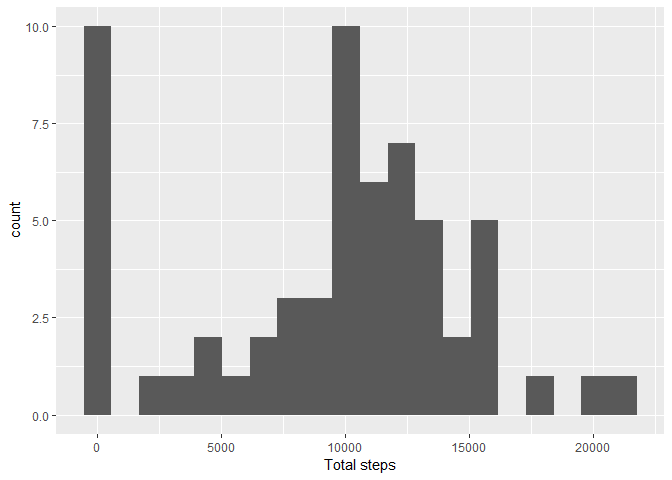
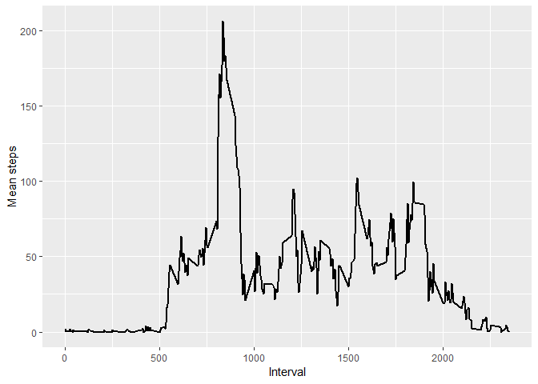
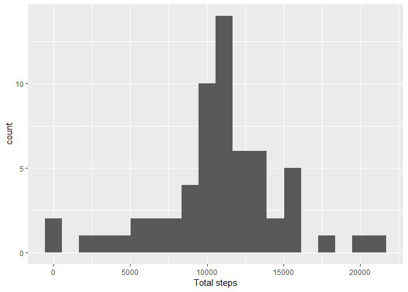
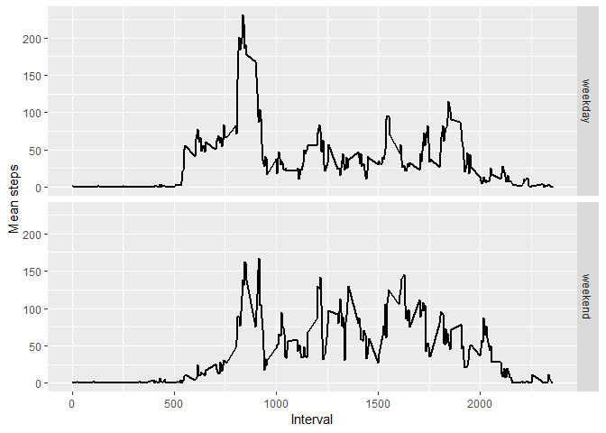

This document contains both the code and results for the first assignment of the course Reproducible Research, from the Data Science especialization offered by John Hopkins University on Coursera.  

Before doing anything, let's load some libraries we'll need.

```r
library(dplyr)
library(lubridate)
library(ggplot2)
library(tidyr)
```


## Reading the data

Assuming that the data file is in the working directory, we can extract and read the data into a variable called 'activity'. After loading the data, we can check a summary of it to see what we're dealing with.


```r
unzip("activity.zip")
activity <- read.csv("activity.csv", stringsAsFactors = FALSE)
str(activity)
```

```
## 'data.frame':	17568 obs. of  3 variables:
##  $ steps   : int  NA NA NA NA NA NA NA NA NA NA ...
##  $ date    : chr  "2012-10-01" "2012-10-01" "2012-10-01" "2012-10-01" ...
##  $ interval: int  0 5 10 15 20 25 30 35 40 45 ...
```

```r
summary(activity)
```

```
##      steps          date              interval   
##  Min.   :  0    Length:17568       Min.   :   0  
##  1st Qu.:  0    Class :character   1st Qu.: 589  
##  Median :  0    Mode  :character   Median :1178  
##  Mean   : 37                       Mean   :1178  
##  3rd Qu.: 12                       3rd Qu.:1766  
##  Max.   :806                       Max.   :2355  
##  NA's   :2304
```

We have then three columns--steps, date and interval--with steps being the variable of interest, and date and interval giving the time intervals during which steps was measured. It's also evident there are many NAs in the data, but we will deal with that later. For now, the data is already tidy so the only transformation needed is to transform the 'date' column into dates.


```r
activity$date <- ymd(activity$date)
```


## What is mean total number of steps taken per day?

For this question we need to calculate the total number of steps per day and visualize it as a histogram.


```r
totalsteps <- activity %>%
    group_by(date) %>%
    summarise(steps = sum(steps, na.rm = TRUE))
meantotsteps <- mean(totalsteps$steps)
mediantotsteps <- median(totalsteps$steps)

totalsteps %>%
    ggplot(aes(steps)) + 
    geom_histogram(bins=20) +
    xlab("Total steps") 
```

<!-- -->

The mean total number of steps taken each day is ``9354.23`` and the median is ``10395``. There are 10 days where there were no steps counted. This is probably a consequence of ignoring NAs in this part. 


## What is the average daily activity pattern?

Instead of calculating the number of steps per day, now we have to calculate the mean steps per 5 minute interval and then plot it as a timeseries. 


```r
dailysteps <- activity %>%
    group_by(interval) %>%
    summarize(meansteps = mean(steps, na.rm = TRUE))

maxsteps <- round(max(dailysteps$meansteps),2)

dailysteps %>%
    ggplot(aes(x=interval, y=meansteps)) + 
    geom_line(lwd=1) +
    ylab("Mean steps") +
    xlab("Interval")
```

<!-- -->

The interval with the maximum number of steps is ``835`` with ``206.17`` steps.


## Imputing missing values

First, we need to know how many NAs are there in the dataset, and how they are distributed.


```r
sum(is.na(activity$steps))
```

```
## [1] 2304
```

```r
nasperday <- activity %>% 
    group_by(date) %>%
    mutate(isna = is.na(steps)) %>%
    summarize(sumnas = sum(isna))
nasperday
```

```
## # A tibble: 61 x 2
##    date       sumnas
##    <date>      <int>
##  1 2012-10-01    288
##  2 2012-10-02      0
##  3 2012-10-03      0
##  4 2012-10-04      0
##  5 2012-10-05      0
##  6 2012-10-06      0
##  7 2012-10-07      0
##  8 2012-10-08    288
##  9 2012-10-09      0
## 10 2012-10-10      0
## # ... with 51 more rows
```

```r
unique(nasperday$sumnas)
```

```
## [1] 288   0
```

This shows that NAs occur in whole days where no data was being recorded, and there are no days with incomplete recordings. Because of this, let's impute the missing values using the daily mean steps per interval. 


```r
### Get the index of the days with NAs
dayswnas <- which(nasperday$sumnas>0)

### Spread activity to make it easy to modify it: activitynona
activitynona <- activity %>%
    spread(key=date, value=steps)

### Replace the missing values
activitynona[, dayswnas+1] <- dailysteps$meansteps
    
### Gather activitynona back
activitynona <- activitynona %>%
    gather(2:dim(activitynona)[2], key="date", value="steps") %>%
    as_tibble
activitynona$date <- ymd(activitynona$date)

### Check that the NAs were imputed
summary(activitynona)
```

```
##     interval         date                steps    
##  Min.   :   0   Min.   :2012-10-01   Min.   :  0  
##  1st Qu.: 589   1st Qu.:2012-10-16   1st Qu.:  0  
##  Median :1178   Median :2012-10-31   Median :  0  
##  Mean   :1178   Mean   :2012-10-31   Mean   : 37  
##  3rd Qu.:1766   3rd Qu.:2012-11-15   3rd Qu.: 27  
##  Max.   :2355   Max.   :2012-11-30   Max.   :806
```

With the values imputed, let's look again at a histogram of mean daily steps.


```r
totalstepsnona <- activitynona %>%
    group_by(date) %>%
    summarise(steps = sum(steps, na.rm = TRUE))
meantotstepsnona <- mean(totalstepsnona$steps)
mediantotstepsnona <- median(totalstepsnona$steps)

totalstepsnona %>%
    ggplot(aes(steps)) + 
    geom_histogram(bins=20) +
    xlab("Total steps") 
```

<!-- -->

The mean total number of steps taken each day is ``10766.19`` and the median is ``10766.19``. Both the mean and the median increased after imputing missing values.


## Are there differences in activity patterns between weekdays and weekends?

First, we create a new dataset using the imputed dataset, including a column that indicates whether a given date is either a weekday or a weekend.


```r
activityweek <- activitynona %>%
    mutate(weekend = weekdays(date)=="Saturday"|weekdays(date)=="Sunday") %>%
    mutate(dayofweek = ifelse(weekend,"weekend", "weekday")) %>%
    select(interval, date, steps, dayofweek)
activityweek$dayofweek <- as.factor(activityweek$dayofweek)
```

With the new dataset we can now see the difference in activity on weekdays and weekends, plotted as a timeseries of daily mean steps per interval. Activity during average weekdays starts and ends earlier than on weekends, peaks around the same time with a higher maximum value, but after the peak is lower than during average weekends. 


```r
dailyweeksteps <- activityweek %>%
    group_by(interval, dayofweek) %>%
    summarize(meansteps = mean(steps, na.rm = TRUE))

dailyweeksteps %>%
    ggplot(aes(x=interval, y=meansteps)) + 
    facet_grid(dayofweek ~ .) +
    geom_line(lwd=1) +
    ylab("Mean steps") +
    xlab("Interval")
```

<!-- -->
